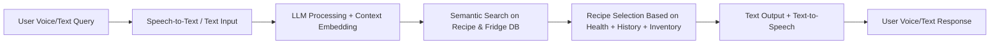

# FridgeSense

Smart AI-powered fridge assistant that helps you track what’s inside your fridge, understand your eating habits, and suggest healthy, personalized recipes.

### System Overview

### Features

📦 Inventory tracking – Knows what items are in your fridge.

🎙 Voice & text input – Ask by talking or typing.

🍲 Personalized recipes – Suggests meals based on what you have, your past meals, and health conditions.

🔍 Semantic search – Finds the best recipe matches using AI embeddings.

🗣 Voice & text output – Get responses in speech or written form.

### Tech Stack

1. Python (main programming language)

2. Transformers / LLM (for understanding your queries)

3. Speech-to-Text & Text-to-Speech (for voice input/output)

4. Semantic Search

5. Database (for storing inventory and meal history)

### How It Works

1. Detect fridge contents (manually added or via image recognition).

2. Understand your query (e.g., “I want something high protein and low carb”).

3. Search recipe database using embeddings.

4. Reply with voice & text including recipe and steps.

